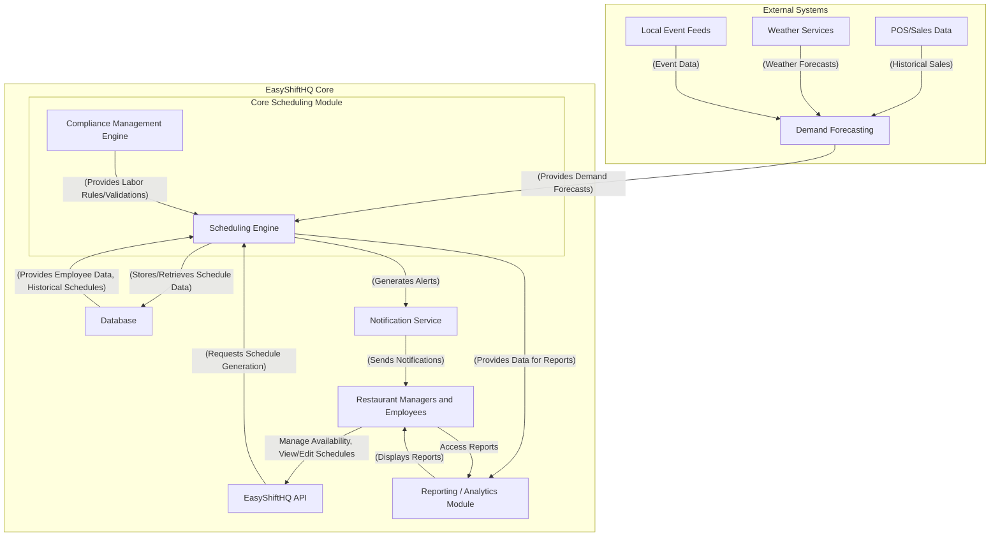
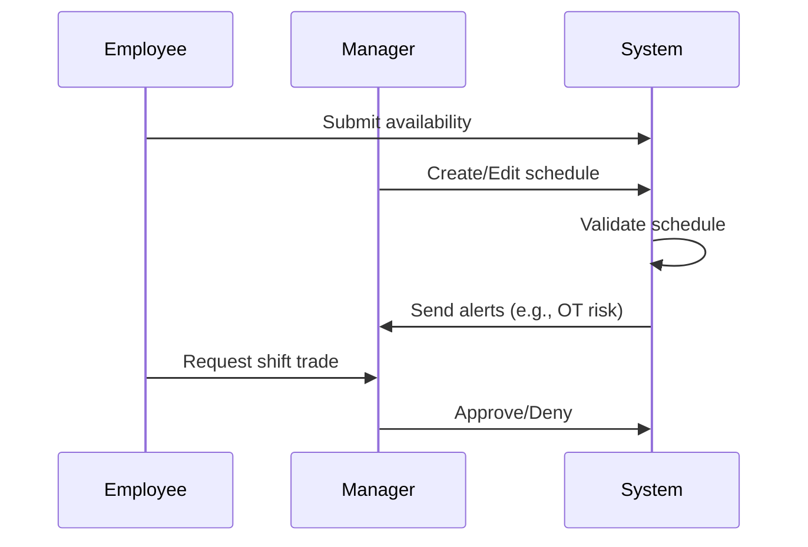

# EasyShiftHQ Architecture Document

## Introduction / Preamble

This document outlines the technical architecture for the Intelligent Schedule Core (MVP) module of EasyShiftHQ. It ensures robust design aligned with the PRD and conforms to EasyShiftHQ development guidelines and ABP.io standards.

## Table of Contents

* Technical Summary
* High-Level Overview
* Architectural / Design Patterns Adopted
* Component View
* Project Structure
* API Reference
* Data Models
* Core Workflow / Sequence Diagrams
* Definitive Tech Stack Selections
* Infrastructure and Deployment Overview
* Epic & Story Breakdown

## Technical Summary

The system is structured around a modular ABP.io-based architecture with a clear separation of concerns:

* Domain logic in `easyshifthq.Domain`
* Data access via Entity Framework Core in `easyshifthq.EntityFrameworkCore`
* API endpoints through `easyshifthq.HttpApi`
* Web UI in `easyshifthq.Web`
* Database management via `easyshifthq.DbMigrator`

## High-Level Overview

* **Architecture Style:** Modular Monolith
* **Repo Structure:** Multi-project, single repository (Monorepo)
* **Primary Flow:**

  * Employees submit availability and view/edit shifts
  * Managers edit/publish schedules and approve changes
  * System detects issues and alerts managers/leadership



## Architectural / Design Patterns Adopted

* **Domain-Driven Design (DDD):** All business logic resides in `Domain`
* **Repository Pattern:** For data access abstraction
* **Service Layer:** Application logic in `Application` layer
* **Modular Monolith:** Well-isolated module boundaries
* **RESTful APIs:** Defined via DTOs and Controllers

## Component View

* **Shift Management Module**

  * Handles creation, editing, and assignment of shifts
* **Availability Module**

  * Collects and stores employee availability
* **Validation & Alert Engine**

  * Detects scheduling conflicts and compliance issues
* **Schedule Viewer**

  * Web component to show role/location-based schedule
* **Leadership Dashboard**

  * Aggregated view with compliance and performance insights

## Project Structure

```plaintext
src/
├── easyshifthq.Domain/                # Core business logic
├── easyshifthq.EntityFrameworkCore/   # EF Core, DbContext, Migrations
├── easyshifthq.Application/           # App services and interfaces
├── easyshifthq.Application.Contracts/ # DTOs, Interfaces
├── easyshifthq.HttpApi/               # Controllers
├── easyshifthq.Web/                   # Web frontend (React + Antd)
├── easyshifthq.DbMigrator/            # DB migration tool
```

## API Reference

### Schedule API (Planned)

* `GET /api/v1/schedules`: List of shifts
* `POST /api/v1/schedules`: Create/update shifts
* `POST /api/v1/shift-trades`: Initiate trade
* `POST /api/v1/availability`: Submit availability

### Location API

* `GET /app/location/{id}`: Retrieve location details by ID
* `PUT /app/location/{id}`: Update location details
* `DELETE /app/location/{id}`: Remove a location
* `GET /app/location`: List all locations
* `POST /app/location`: Create a new location
* `GET /app/location/active-locations`: Get list of active locations
* `GET /app/location/locations-in-jurisdiction`: Get locations by jurisdiction
* `GET /app/location/locations-by-time-zone`: Get locations grouped by timezone
* `POST /app/location/{id}/set-active`: Set location active status

## Data Models

Key Entities:

* `Employee`
* `Shift`
* `Availability`
* `ShiftTrade`
* `ScheduleAlert`

## Core Workflow / Sequence Diagrams



## Definitive Tech Stack Selections

| Category      | Technology        | Version / Details | Purpose                       |
| ------------- | ----------------- | ----------------- | ----------------------------- |
| Languages     | C#, TypeScript    | .NET 7, TS 5.x    | Backend, frontend             |
| Runtime       | .NET              | 7.x               | Server-side execution         |
| Frameworks    | ABP.io, React     | Latest            | Backend API, UI layer         |
| Database      | SQL Server        | 2022+             | Primary relational store      |
| ORM           | EF Core           | 7.x               | ORM and migrations            |
| Testing       | xUnit, Playwright | Latest            | Unit, integration, UI testing |
| CI/CD         | GitHub Actions    | N/A               | Build, test, deploy pipeline  |
| Infra as Code | Terraform/CDK     | TBD               | Infra management              |

## Infrastructure and Deployment Overview

* **Hosting:** Azure App Services or Kubernetes (TBD)
* **CI/CD:** GitHub Actions for build + deploy
* **DB Management:** Code-first migrations via DbMigrator
* **Monitoring:** Application Insights or New Relic (TBD)
* **Scaling:** Horizontal scaling with app services or K8s
* **Security:** OAuth 2.0 + role-based auth via ABP
* **Environments:** Dev, Staging, Production
* **Rollback Strategy:** Automated rollback on CI/CD failure

## Epic & Story Breakdown

### 📦 Epic 1: Employee Availability Management

**Goal:** Allow employees to input, view, and update their availability and time-off.

**Stories:**

* `Story 1.1`: Create `Availability` entity in `easyshifthq.Domain.Entities` with DayOfWeek enum, StartTime, EndTime. Add EF Core migration.
* `Story 1.2`: Add `IAvailabilityAppService` with Submit and Update endpoints. Implement DTOs.
* `Story 1.3`: Build frontend React component using AntD for employee inputs.
* `Story 1.4`: Trigger manager notifications using ABP's event system on time-off submission.

### 📦 Epic 2: Shift Scheduling Engine

**Goal:** Enable creation, editing, and publishing of schedules by managers.

**Stories:**

* `Story 2.1`: Add `Shift` entity with Role, StartTime, EndTime, LocationId. Add EF Core migration.
  * Create `Shift` entity in `easyshifthq.Domain/Shifts` with the following properties:
    * Basic properties: Id (Guid), TenantId (Guid?), LocationId (Guid), EmployeeId (Guid?), Title (string), Role (string), StartTime (DateTime), EndTime (DateTime), Status (ShiftStatus enum)
    * Additional properties: Notes (string?), Color (string?), IsPublished (bool)
    * Role properties: RoleId (Guid?), RoleName (string) - Store both ID and name for efficient querying
    * Date information: ShiftDate (DateTime) to easily filter by specific date without time component
    * Employee tracking: Add navigation property to Employee entity, include WeeklyHours tracking property to track current scheduled hours for validation
    * Availability tracking: Add reference to employee availability records to enable validation against both regular availability and time-off requests
  * Create `ShiftStatus` enum in `easyshifthq.Domain.Shared/Shifts` with values: `Draft`, `Published`, `Cancelled`
  * Create `ShiftConsts` in `easyshifthq.Domain.Shared/Shifts` with maximum length constants:
    * MaxTitleLength = 128
    * MaxRoleLength = 128
    * MaxNotesLength = 1000
    * MaxColorLength = 10
  * Create `Role` entity in `easyshifthq.Domain/Roles` with properties:
    * Basic properties: Id (Guid), TenantId (Guid?), Name (string), Description (string?)
    * Additional properties: IsActive (bool), Color (string?)
  * Add `IShiftRepository` interface in `easyshifthq.Domain/Shifts` with specialized methods:
    * `GetShiftsByDateRangeAsync(DateTime startDate, DateTime endDate, Guid? locationId = null)`
    * `GetShiftsByEmployeeAsync(Guid employeeId, DateTime? startDate = null, DateTime? endDate = null)`
    * `GetShiftsByLocationAsync(Guid locationId, DateTime? startDate = null, DateTime? endDate = null)`
    * `GetEmployeeWeeklyHoursAsync(Guid employeeId, DateTime weekStartDate)` - Calculate total hours scheduled for an employee in a week
    * `GetUnavailableDateRangesAsync(Guid employeeId, DateTime startDate, DateTime endDate)` - Retrieve all time-off periods for an employee within a date range
  * Implement `EfCoreShiftRepository` in `easyshifthq.EntityFrameworkCore/Shifts`
  * Update `EasyShiftHQDbContext` to include `DbSet<Shift>` and `DbSet<Role>` properties
  * Add EF Core migration using `dotnet ef migrations add Added_Shift_And_Role_Entities -p ../easyshifthq.EntityFrameworkCore -s ../easyshifthq.DbMigrator`
  * Update database using DbMigrator project

* `Story 2.2`: Implement domain logic for conflict checking and validation.
  * Create `ShiftManager` domain service in `easyshifthq.Domain/Shifts` with methods:
    * `ValidateShift()` - Checks if shift times are valid (end > start)
    * `CheckForConflicts()` - Detects overlapping shifts for the same employee
    * `CheckEmployeeAvailability()` - Verifies employee is available for shift
    * `CheckTimeOffRequests()` - Verifies shift does not overlap with approved time-off
    * `CalculateHoursInPeriod()` - Computes total employee hours in a week
    * `AssignEmployeeToShift()` - Handles employee assignment with all validations
    * `GetEmployeeWeeklySchedule()` - Retrieves all shifts for an employee in a week
  * Add business rules for validations:
    * Prevent scheduling outside of availability
    * Block scheduling during approved time-off/vacation periods
    * Check for double-booking employees
    * Validate minimum rest periods between shifts
    * Verify location operating hours
    * Ensure all required fields are provided (Role, Start Time, End Time, Date, Location)
    * Validate time format (12-hour format with AM/PM)
    * Ensure shifts don't span multiple days (if business rule requires)
    * Track employee weekly hours when assigning shifts
    * Validate against overtime rules based on employee type (full-time/part-time)
    * Check employee qualifications for assigned role
  * Add domain events:
    * `ShiftAssignedEto` - When employee is assigned to shift
    * `ShiftSchedulePublishedEto` - When schedule is published
    * `ShiftConflictDetectedEto` - When conflict is detected
    * `EmployeeOvertimeRiskEto` - When employee approaches overtime threshold
    * `TimeOffConflictDetectedEto` - When shift conflicts with approved time-off

* `Story 2.3`: Create shift management application services.
  * Add DTOs in `easyshifthq.Application.Contracts/Shifts`:
    * `ShiftDto` - For shift data transfer
    * `CreateUpdateShiftDto` - For creating/updating shifts
    * `PublishScheduleDto` - For publishing schedule
    * `GetShiftListDto` - For filtering shifts by date range, location, employee
    * `ShiftScheduleDto` - For weekly schedule view
    * `EmployeeAvailabilityDto` - For employee availability including time-off periods
    * `TimeOffPeriodDto` - For representing approved time-off requests
  * Add interfaces in `easyshifthq.Application.Contracts/Shifts`:
    * `IShiftAppService` with CRUD operations, publish, and bulk operations
    * `IShiftTemplateAppService` for managing schedule templates
    * Add methods to retrieve availability and time-off:
      * `GetEmployeeAvailabilityAsync(Guid employeeId, DateTime startDate, DateTime endDate)`
      * `GetTimeOffPeriodsAsync(DateTime startDate, DateTime endDate, Guid? locationId = null)`
  * Implement services in `easyshifthq.Application/Shifts`:
    * `ShiftAppService` with methods for CRUD, publish, bulk operations
    * `ShiftTemplateAppService` for template functionality
    * Implement validation against time-off periods before creating or updating shifts
    * Add caching for frequently accessed time-off data to improve performance
  * Add permissions in `easyshifthqPermissionDefinitionProvider.cs`:
    * `EasyShiftHQ.Shifts` group with Create, Edit, Delete, Publish permissions

* `Story 2.4`: Build schedule editor UI and components.
  * Create Razor Pages in `easyshifthq.Web/Pages/Shifts`:
    * `Index.cshtml` - Main schedule management page with:
      * Location selector dropdown
      * Week navigation controls
      * Schedule grid with time slots and days
      * Employee pool sidebar
      * Visual indicators for time-off/unavailability patterns
    * `ShiftModal.cshtml` - Modal for creating/editing shifts with:
      * Role selection dropdown (populated from Role entities)
      * Time picker components (formatted as HH:MM AM/PM)
      * Date picker with day of week display
      * Location dropdown (showing location name and code)
      * Notes text area for additional information
      * Create Shift and Cancel buttons
    * `ShiftDetailsModal.cshtml` - Modal for viewing and editing existing shifts:
      * Employee assignment dropdown with display of weekly hours
      * Role selection dropdown (populated from Role entities)
      * Time picker components (formatted as HH:MM AM/PM)
      * Location selection
      * Status selector (Draft, Published, Cancelled)
      * Notes field for additional information
      * Update Shift button
      * Visual indicator showing employee's current weekly scheduled hours
      * Warning if employee has time-off overlapping with shift
    * `Templates.cshtml` - Page for managing schedule templates
  * Create JavaScript modules in `easyshifthq.Web/Pages/Shifts`:
    * `schedule-editor.js` - Main schedule management JavaScript
    * `shift-modal.js` - Shift creation/edit modal handler:
      * Form validation for required fields
      * Time format handling (12-hour format display)
      * Automatic conflict detection
      * Time-off validation
    * `shift-details.js` - Shift details modal handler:
      * Handle employee assignment with conflict checking
      * Update shift hours and recalculate weekly hours
      * Validate against employee availability
      * Display warnings for potential scheduling violations
      * Prevent assignment during approved time-off periods
    * `templates.js` - Template management functions
  * Implement drag-and-drop functionality:
    * Use ABP's bundling system to include a drag-drop library
    * Enable dragging employees to time slots
    * Allow moving/resizing shifts within the schedule
    * Implement shift duplication via drag+Ctrl
    * Enable clicking on existing shifts to open ShiftDetailsModal
    * Disable dropping employees onto time slots that overlap with their approved time-off
  * Add real-time validation feedback:
    * Show visual indicators for conflicts
    * Display warnings for overtime or compliance issues
    * Add tooltips for shift details on hover
    * Show employee weekly hours during shift assignment
    * Highlight time-off periods with distinct visual styling (similar to Google Calendar OOO indicators)
    * Display blocked time slots for employees on vacation/time-off

* `Story 2.5`: Implement publishing workflow and templates.
  * Create schedule publishing workflow:
    * Add draft state for unpublished schedules
    * Implement comprehensive validation before publishing
    * Add confirmation dialog with validation summary
    * Create notification system for published schedules
  * Implement schedule templates:
    * Allow saving current schedule as template
    * Provide template selection and application
    * Support partial template application (specific days/roles)
  * Add bulk operations:
    * Copy shifts from previous week
    * Delete all shifts in selected range
    * Reassign shifts between employees
  * Create schedule views:
    * By employee view
    * By role/position view
    * Print-friendly view

* `Story 2.6`: Write integration tests and Playwright UI tests.
  * Add unit tests in `easyshifthq.Domain.Tests/Shifts`:
    * `ShiftManager_Tests` for domain logic validation
    * `Shift_Tests` for entity validation
  * Add integration tests in `easyshifthq.Application.Tests/Shifts`:
    * `ShiftAppService_Tests` for CRUD operations
    * `ShiftAppService_Validation_Tests` for validation logic
    * `ShiftTemplateAppService_Tests` for template functionality
  * Add UI tests with Playwright in `easyshifthq.Web.Tests`:
    * Test drag-and-drop functionality
    * Test shift creation and editing
    * Test schedule publishing flow
    * Test conflict detection and resolution

### 📦 Epic 3: Shift Trade Workflow

**Goal:** Let employees request trades and managers approve/deny them.

**Stories:**

* `Story 3.1`: Create `ShiftTrade` entity with Status, Reason. Add migration.
* `Story 3.2`: Build UI for trade request and status tracking.
* `Story 3.3`: Notify relevant parties and log approval steps.

### 📦 Epic 4: Alert & Validation System

**Goal:** Warn users about overstaffing, OT risks, and uncovered shifts.

**Stories:**

* `Story 4.1`: Build rule engine service for validations.
* `Story 4.2`: Display validation results in UI.
* `Story 4.3`: Send real-time alert notifications using ABP Notifier.

### 📦 Epic 5: Leadership Dashboard

**Goal:** Provide high-level visibility into labor trends and compliance.

**Stories:**

* `Story 5.1`: Aggregate shift data for dashboard widgets.
* `Story 5.2`: Implement location-based heatmaps for over/understaffing.
* `Story 5.3`: Enforce leadership-only access control policies.

### 📦 Epic 6: Compliance & Policy Engine (MVP Scope)

**Goal:** Enforce basic labor law constraints like shift spacing and OT limits.

**Stories:**

* `Story 6.1`: Define configurable rules in app settings.
* `Story 6.2`: Validate shifts against compliance rules before save.
* `Story 6.3`: Highlight violations and allow override with reason.

---

> All stories are scoped for `easyshifthq`'s ABP.io modular architecture and align with current folder/project conventions. Stories can now be handed off to the Scrum Master or Developers for sprint grooming and implementation.
