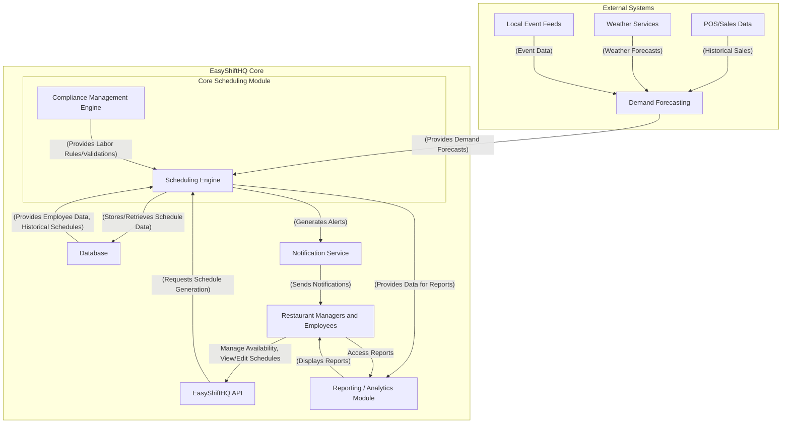
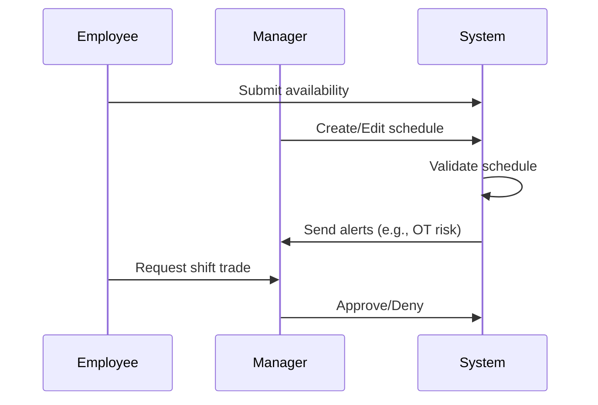

# EasyShiftHQ Architecture Document

## Introduction / Preamble

This document outlines the technical architecture for the Intelligent Schedule Core (MVP) module of EasyShiftHQ. It ensures robust design aligned with the PRD and conforms to EasyShiftHQ development guidelines and ABP.io standards.

## Table of Contents

* Technical Summary
* High-Level Overview
* Architectural / Design Patterns Adopted
* Component View
* Project Structure
* API Reference
* Data Models
* Core Workflow / Sequence Diagrams
* Definitive Tech Stack Selections
* Infrastructure and Deployment Overview
* Epic & Story Breakdown

## Technical Summary

The system is structured around a modular ABP.io-based architecture with a clear separation of concerns:

* Domain logic in `easyshifthq.Domain`
* Data access via Entity Framework Core in `easyshifthq.EntityFrameworkCore`
* API endpoints through `easyshifthq.HttpApi`
* Web UI in `easyshifthq.Web`
* Database management via `easyshifthq.DbMigrator`

## High-Level Overview

* **Architecture Style:** Modular Monolith
* **Repo Structure:** Multi-project, single repository (Monorepo)
* **Primary Flow:**

  * Employees submit availability and view/edit shifts
  * Managers edit/publish schedules and approve changes
  * System detects issues and alerts managers/leadership



## Architectural / Design Patterns Adopted

* **Domain-Driven Design (DDD):** All business logic resides in `Domain`
* **Repository Pattern:** For data access abstraction
* **Service Layer:** Application logic in `Application` layer
* **Modular Monolith:** Well-isolated module boundaries
* **RESTful APIs:** Defined via DTOs and Controllers

## Component View

* **Shift Management Module**

  * Handles creation, editing, and assignment of shifts
* **Availability Module**

  * Collects and stores employee availability
* **Validation & Alert Engine**

  * Detects scheduling conflicts and compliance issues
* **Schedule Viewer**

  * Web component to show role/location-based schedule
* **Leadership Dashboard**

  * Aggregated view with compliance and performance insights

## Project Structure

```plaintext
src/
├── easyshifthq.Domain/                # Core business logic
├── easyshifthq.EntityFrameworkCore/   # EF Core, DbContext, Migrations
├── easyshifthq.Application/           # App services and interfaces
├── easyshifthq.Application.Contracts/ # DTOs, Interfaces
├── easyshifthq.HttpApi/               # Controllers
├── easyshifthq.Web/                   # Web frontend (React + Antd)
├── easyshifthq.DbMigrator/            # DB migration tool
```

## API Reference

### Schedule API (Planned)

* `GET /api/v1/schedules`: List of shifts
* `POST /api/v1/schedules`: Create/update shifts
* `POST /api/v1/shift-trades`: Initiate trade
* `POST /api/v1/availability`: Submit availability

## Data Models

Key Entities:

* `Employee`
* `Shift`
* `Availability`
* `ShiftTrade`
* `ScheduleAlert`

## Core Workflow / Sequence Diagrams



## Definitive Tech Stack Selections

| Category      | Technology        | Version / Details | Purpose                       |
| ------------- | ----------------- | ----------------- | ----------------------------- |
| Languages     | C#, TypeScript    | .NET 7, TS 5.x    | Backend, frontend             |
| Runtime       | .NET              | 7.x               | Server-side execution         |
| Frameworks    | ABP.io, React     | Latest            | Backend API, UI layer         |
| Database      | SQL Server        | 2022+             | Primary relational store      |
| ORM           | EF Core           | 7.x               | ORM and migrations            |
| Testing       | xUnit, Playwright | Latest            | Unit, integration, UI testing |
| CI/CD         | GitHub Actions    | N/A               | Build, test, deploy pipeline  |
| Infra as Code | Terraform/CDK     | TBD               | Infra management              |

## Infrastructure and Deployment Overview

* **Hosting:** Azure App Services or Kubernetes (TBD)
* **CI/CD:** GitHub Actions for build + deploy
* **DB Management:** Code-first migrations via DbMigrator
* **Monitoring:** Application Insights or New Relic (TBD)
* **Scaling:** Horizontal scaling with app services or K8s
* **Security:** OAuth 2.0 + role-based auth via ABP
* **Environments:** Dev, Staging, Production
* **Rollback Strategy:** Automated rollback on CI/CD failure

## Epic & Story Breakdown

### 📦 Epic 1: Employee Availability Management

**Goal:** Allow employees to input, view, and update their availability and time-off.

**Stories:**

* `Story 1.1`: Create `Availability` entity in `easyshifthq.Domain.Entities` with DayOfWeek enum, StartTime, EndTime. Add EF Core migration.
* `Story 1.2`: Add `IAvailabilityAppService` with Submit and Update endpoints. Implement DTOs.
* `Story 1.3`: Build frontend React component using AntD for employee inputs.
* `Story 1.4`: Trigger manager notifications using ABP's event system on time-off submission.

### 📦 Epic 2: Shift Scheduling Engine

**Goal:** Enable creation, editing, and publishing of schedules by managers.

**Stories:**

* `Story 2.1`: Add `Shift` entity with Role, StartTime, EndTime, LocationId. Add EF Core migration.
* `Story 2.2`: Implement domain logic for conflict checking and validation.
* `Story 2.3`: Create drag-and-drop React calendar editor.
* `Story 2.4`: Enable shift duplication, shift pool.
* `Story 2.5`: Write integration tests and Playwright UI tests.

### 📦 Epic 3: Shift Trade Workflow

**Goal:** Let employees request trades and managers approve/deny them.

**Stories:**

* `Story 3.1`: Create `ShiftTrade` entity with Status, Reason. Add migration.
* `Story 3.2`: Build UI for trade request and status tracking.
* `Story 3.3`: Notify relevant parties and log approval steps.

### 📦 Epic 4: Alert & Validation System

**Goal:** Warn users about overstaffing, OT risks, and uncovered shifts.

**Stories:**

* `Story 4.1`: Build rule engine service for validations.
* `Story 4.2`: Display validation results in UI.
* `Story 4.3`: Send real-time alert notifications using ABP Notifier.

### 📦 Epic 5: Leadership Dashboard

**Goal:** Provide high-level visibility into labor trends and compliance.

**Stories:**

* `Story 5.1`: Aggregate shift data for dashboard widgets.
* `Story 5.2`: Implement location-based heatmaps for over/understaffing.
* `Story 5.3`: Enforce leadership-only access control policies.

### 📦 Epic 6: Compliance & Policy Engine (MVP Scope)

**Goal:** Enforce basic labor law constraints like shift spacing and OT limits.

**Stories:**

* `Story 6.1`: Define configurable rules in app settings.
* `Story 6.2`: Validate shifts against compliance rules before save.
* `Story 6.3`: Highlight violations and allow override with reason.

---

> All stories are scoped for `easyshifthq`'s ABP.io modular architecture and align with current folder/project conventions. Stories can now be handed off to the Scrum Master or Developers for sprint grooming and implementation.
